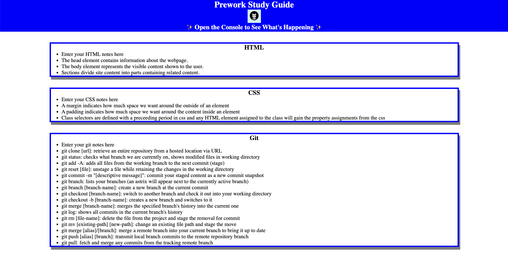

# Bootcamp Study Guide

## Description

This study guide webpage was created to help bootcamp students study the topics they learned in prework. These topics include HTML, CSS, git, and JavaScript. Notes for each topic are listed in thier respective sections and in the console, a random topic is suggested to be studied.

## Installation

Installation is not necessary.

## Usage

To use this study guide, you can review the notes in each section. Additionally, you can receive a random suggestion about which topic to study first by opening the console. To open the console, press ```Command+Options+I``` (MacOS) or ```Control+Shift+I``` (Windows). The console window should appear to the right side or underneath the webpage in the browser.



## Credits

N/A

## License

MIT License. Refer to the LICENSE in the repo.

